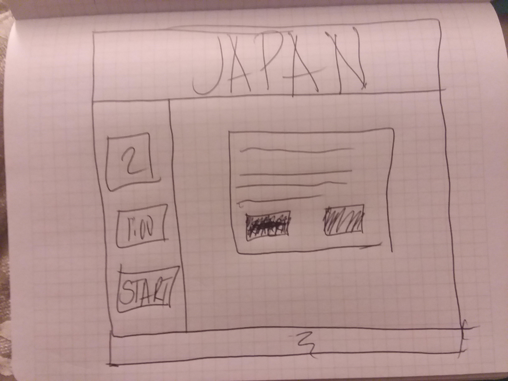
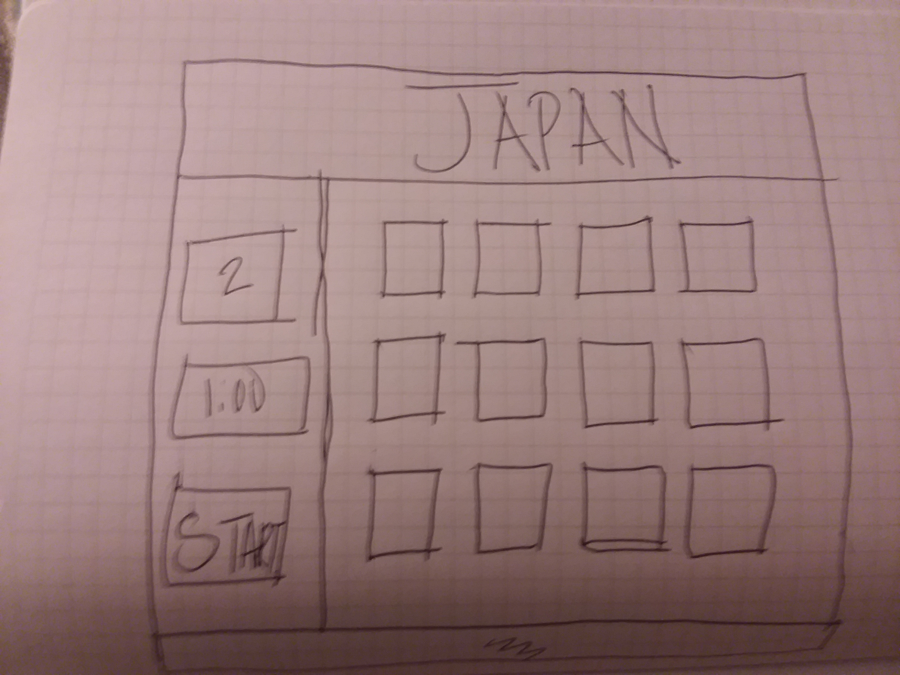
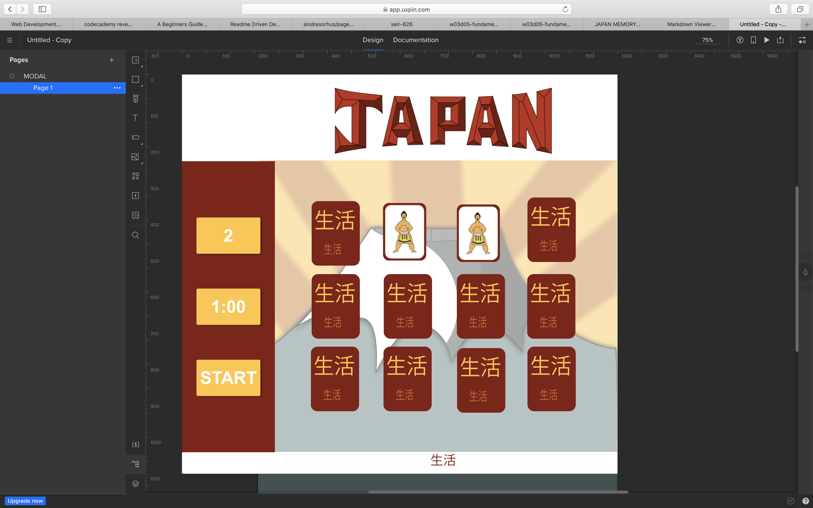
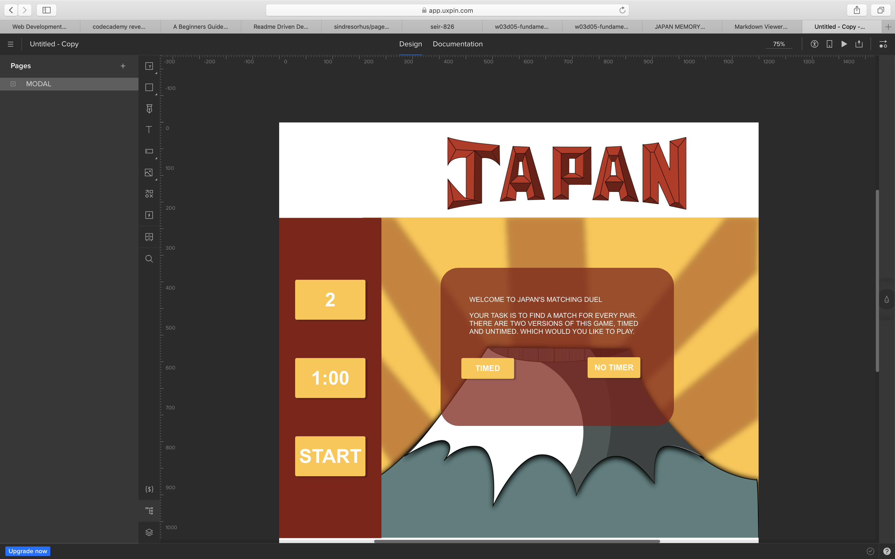
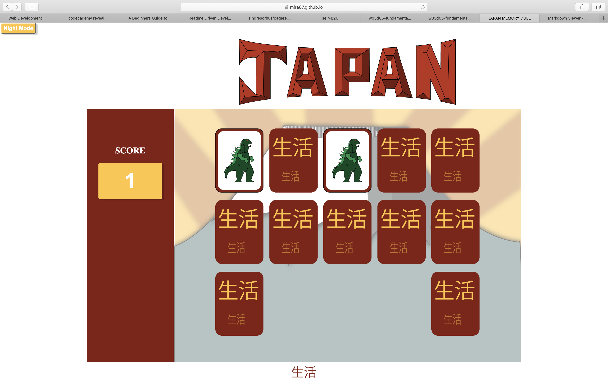

# Japan Memory Duel

## This is a flash card game that tests your memory. Match pairs and receive 1 point.


https://mira87.github.io/memory-game/
---


---
##Motivation

The motivation of this game was based on the fact I wanted it to look appealing and for viewers to see it and become interested in playing it. I wanted the images to draw the viewer and of course I wanted them to enjoy my handy work.
:+1: 

---
##Getting Started

I first brainstormed what game I wanted to make. I then wireframed it quickly on a sheet of paper. I then layed out the frame work in UXPin. UXPin is great for getting a lot of information that you will need for your CSS. However, make sure to check your code because not everything on there is correct.






As you can see from the photos and the actual product thing changed slightly. That's part of the creative process.

I then created a repository in GitHub.

I then cloned the repository so it could be linked to my computer. 

```
git clone https://github.com/username/username.github.io

```

I added this project folder and index.html file.
```
cd username.github.io
echo "Hello World" > index.html

```
I then pushed those changes up to GitHub and made sure I was connected and that the changes I made were actually happening.

```
git add --all
git commit -m "Initial commit"
git push -u origin master

```

Make sure to commit often and to push often for best practices.


I then worked on Pseudo Code. This is a great way to say this is my GOAL and these are my little goals and this is how I need to get those things accomplished. This was very important for this project, especially for determining the best method to get the cards to flip.

---
##Coding Languages Used

The coding languages used were HTML, CSS, and JavaScript. 

The HTML was used to lay the skeleteon of the game. It was used to link the files, and to set nodes that could be grabbed with my JavaScript. The Japan logo was added directly in the HTML. The cards were as well. They were styled of course in the CSS. I was actually able to determine if a card appeared as the background or front facing by using the following syntax in my HTML.

```
                


```

All cards by default appeared as background cards. However, I was able to  allow it to change upon click may adding the following code in my JavaScript.

```
        e.target.src=e.target.dataset.img;


```



---

I added a few cool bells and whistles that I enjoy when I play games online. For example, I added a lights off mode. Just my way of really rocking this project. Hey what can I say. Thats what I do!!!

